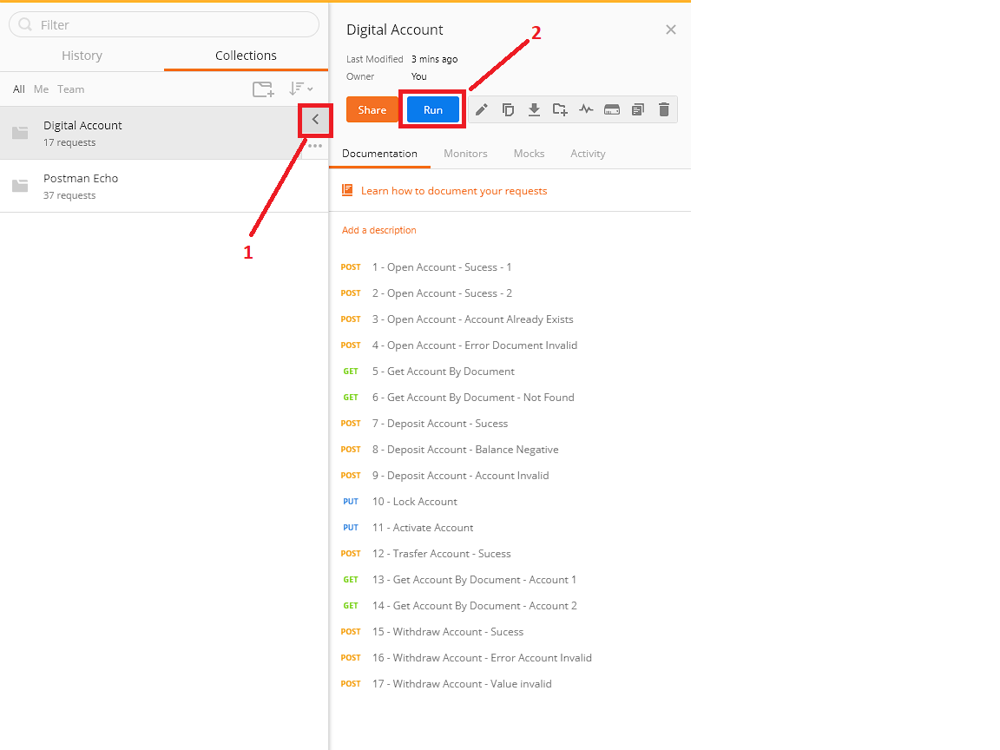
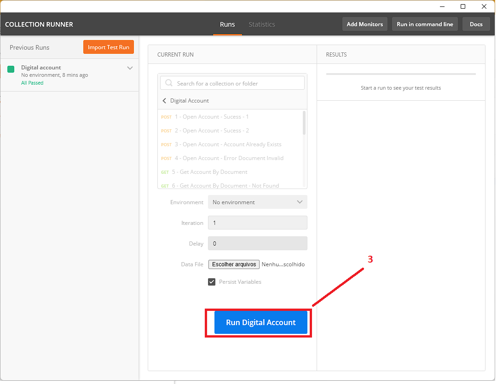
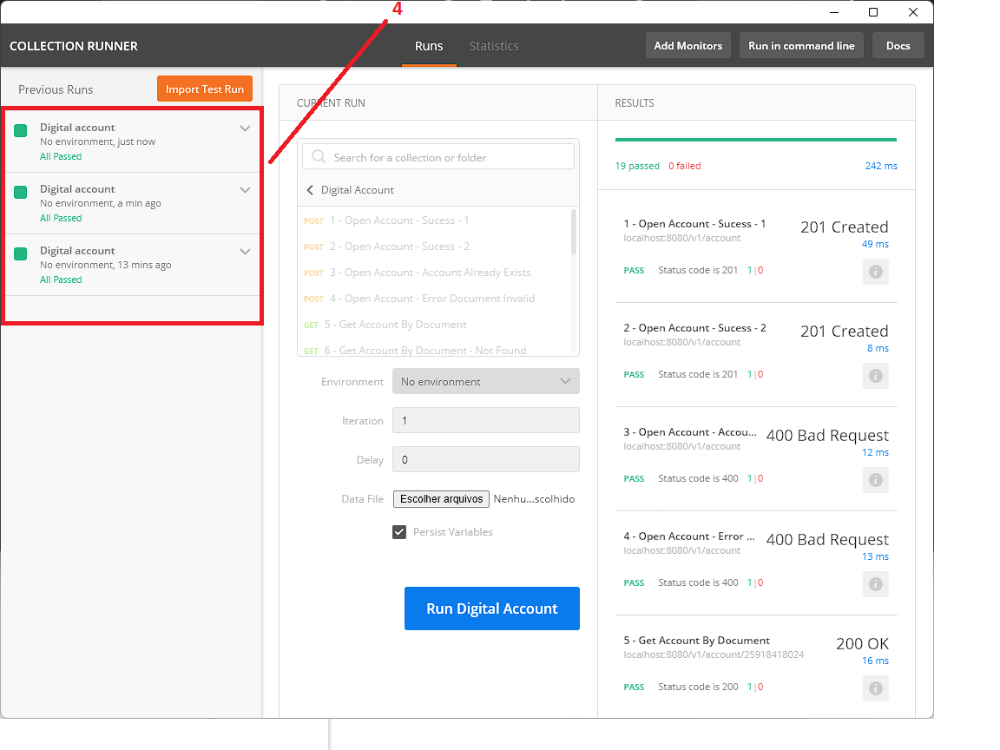

# challenge-developper-api-rest

<p align="left">
    <a href="https://github.com/axsilva1991/challenge-developper-api-rest/actions">
      
    </a>
</p>

This repository is a implementation an academic project for the creation of a fictitious digital bank.


## Functional requirements for challenge

You need to create a digital bank when:

- It must be possible to create and remove **holder**
  - a **holder** must contain only your *name* and *Document Number*
  - The *Document Number* must be valid and unique in the registration of **holder**
- The **digital accounts** must contain the following features:
  - The account must be created using the *Document Number* do **holder**
  - An account must have its *balance*, *number* e *agency* available for Query
  - Required for *find history balance account* from *per period*
  - A **holder** can close the **digital account** at any time
  - Perform *withdrawal* and *deposit* operations
    - *Deposit* is released to all *active* and *unlocked* accounts
    - *Withdrawal* is allowed for all *active* and *unlocked* accounts as long as there is *available balance* and does not exceed the daily limit of *2 thousand R$*

## Mandatory regulation


- We need to *lock* and *unlock* the **digital account** at any time
- The **digital account** can never have the *negative balance*


# Api-Rest

* [Some Concepts off the Clean Architecture](https://www.amazon.com.br/Clean-Architecture-Craftsmans-Software-Structure/dp/0134494164)
* [H2 Database for save transactions](https://www.h2database.com/html/quickstart.html)
* [SpringBoot](https://docs.spring.io/spring-boot/docs/current/reference/htmlsingle/)
* [Junit for Unit Tests](https://junit.org/junit5/docs/current/user-guide/)
* [Spring Data](https://docs.spring.io/spring-data/jpa/docs/current/reference/html/)
* [Open API 3.0 specification](https://swagger.io/specification/)

# Requirements for Run Application
* Docker
* Docker Compose
* Kubernetes node cluster
* RestAPI Client's for example: (Postman/Insomnia)
* Access Internet for gradlew dependency's download
# Usage
## Run the app anyway

<details>
<summary><b>Docker</b></summary>

### Run
```bash
$ cd .\challenge-developper-api-rest_webapp\
$ docker-compose up --build -d
```

### Shut down

```bash
cd .\challenge-developper-api-rest_webapp\
$ docker-compose down
```
</details>

<details>
<summary><b>Kubernetes</b></summary>  

After build image docker local, run ```docker images``` command and confirm if **digital_account_webapp** was created
```bash
REPOSITORY                                                TAG                                                                          IMAGE ID       CREATED             SIZE
challenge-developper-api-rest_webapp                                    latest                                                                       e3e73a0811cc   About an hour ago   1.28GB
```

Run command for create service

```bash
$ cd .\challenge-developper-api-rest_webapp\
$ .\kubernetes> kubectl apply -f .\kubernetes\service.yaml
service/challenge-developper-api-rest-webapp-svc created
```
Run command for create deployment

```bash
$ cd .\challenge-developper-api-rest_webapp\
$ .\kubernetes> kubectl apply -f .\kubernetes\deployment.yaml
deployment.apps/challenge-developper-api-rest-webapp-k8s created
```

After run this commands access [swagger](http://localhost:8080/api-docs/swagger-ui/index.html) to validate application its ok.


</details>

## Test

For test api's you need to import [postman collection.json](./postman_collections/Digital%20Account.postman_collection.json)

If you need [click here](https://learning.postman.com/docs/getting-started/importing-and-exporting-data/) to know how to import the collections in postman.


>**Atention** <br>Because it is a integration test, it's work's if you run one time! <br>
>if you need to re-execute it, it is recommended to clean the database or restart the application.

<details>
<summary><b>Run integration test:</b></summary>  

* 1 - Click on the button marked to the left with the number one.
* 2 - Click Run 
    
* 3 - Click Run Digital Account
  
* 4 - After Run the test's. you can view the results
  
</details>

## Documentation

This project Using OpenAPI 3.0 specification if you whant to see a doc open [swagger-ui](http://localhost:8080/api-docs/swagger-ui/index.html) in your Browser
